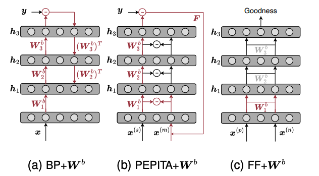

# Binary Forward-Only Algorithms

This repository provides the reproducible code for all the reported results in the paper **Binary Forward-Only Algorithms**.




The codes for binary version of the state-of-the-art forward-only algorithms are provided, including PEPITA<sup>[1]</sup>, FF<sup>[2]</sup> and BP<sup>[3]</sup> on MNIST, CIFAR-10, [MIT-BIH](https://www.physionet.org/content/mitdb/1.0.0/) datastes. 


The codes are shown as follows:
- BP with binarization: ``python BinaryBP/Main.py ``
- PEPITA with binarization: ``python BinaryPEPITA/pepita.py ``
- FF with binarization: ``python BinaryFF/main.py ``

> The parameters `dataset`, `binary_w` (binary weights) and `binary_a` (binary activations) need to be changed accordingly.

## Extension
We extend to CwComp<sup>[4]</sup> on MNIST, CIFAR-10 to explore. The codes are shown as follows:
- CwComp with binarization: ``python BinaryCwComp/src/main_train.py ``


[1] Dellaferrera, Giorgia, and Gabriel Kreiman. "Error-driven input modulation: solving the credit assignment problem without a backward pass." International Conference on Machine Learning. PMLR, 2022.

[2] Hinton, Geoffrey. "The forward-forward algorithm: Some preliminary investigations." arXiv preprint arXiv:2212.13345 (2022).

[3] Rumelhart, David E., Geoffrey E. Hinton, and Ronald J. Williams. "Learning representations by back-propagating errors." nature 323.6088 (1986): 533-536.

[4] Papachristodoulou, Andreas, et al. "Convolutional Channel-Wise Competitive Learning for the Forward-Forward Algorithm." Proceedings of the AAAI Conference on Artificial Intelligence. Vol. 38. No. 13. 2024.


## Citation
```
@article{huang2025binary,
  title={Binary Forward-Only Algorithms},
  author={Huang, Baichuan and Aminifar, Amir},
  journal={IEEE Design & Test},
  year={2025},
  publisher={IEEE},
  doi={10.1109/MDAT.2025.3528366}
}
```